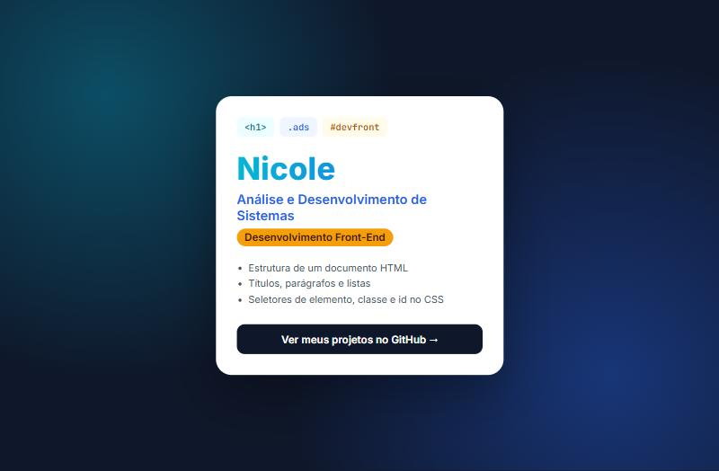

# 👋 Introdução ao HTML

Página de apresentação feita na **primeira aula de HTML** do curso de **Análise e Desenvolvimento de Sistemas**, na disciplina de Desenvolvimento Front-End. Pratica a estrutura de um documento HTML e os três tipos básicos de seletor do CSS.

  

## 📚 O que a página pratica

| Seletor | Exemplo | Onde aparece |
|---|---|---|
| Elemento | `h1 { … }` | O nome, com texto em degradê |
| Classe | `.ads { … }` | O curso e a lista de conceitos (a mesma classe em dois elementos) |
| Id | `#devfront { … }` | A etiqueta da disciplina (um único elemento) |

O [`main.css`](main.css) tem comentários explicando cada um.

## 🔧 O que foi corrigido

- O HTML carregava um `main.js` que não existe, o que gerava um erro 404 no navegador
- Título da aba "Page Title" trocado por um título de verdade, e idioma da página declarado (`lang="pt-BR"`)
- Imagem carregada de outro site trocada por um elemento visual feito só com CSS

## 🛠️ Tecnologias

HTML · CSS

## 🚀 Como executar

Baixe o repositório e abra o `index.html` no navegador.
